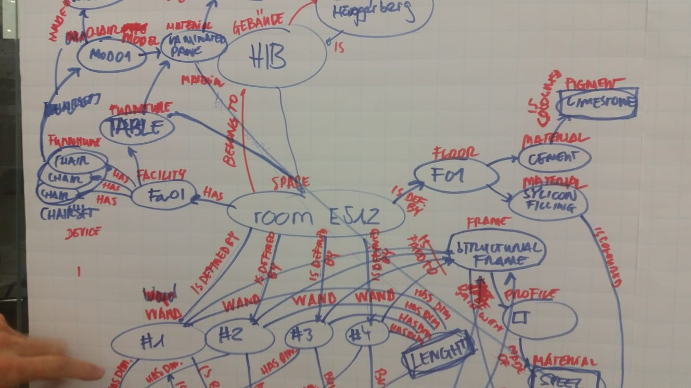

# Intro to Linked Data and Semantic Web: the Basics

Pieter Pauwels, Ghent University

Mads Holten Rasmussen, NIRAS

The first session of the LDAC summer school is about the vision and basics of the Semantic Web and Linked Data. You will be introduced to Linked Data in general, and with the work of the Linked Building Data (LBD) community group in particular. Through a number of slides, you will be introduced to the technical basics. More specifically, this session introduces the concept of linked data, graphs, ontologies, and graph-based information modelling in general. 

Through the exercises listed in this document, you’ll learn to think in terms of graphs about the built environment that surrounds you. More particularly, you will apply this to the room in which you are currently in. Furthermore, you’ll learn how to represent this room in an RDF graph, and you’ll be introduced to the concept of ontologies and vocabularies.

### Learning objectives
-	Understand the principles of Linked (Building) Data (LBD)
-	Understand the basics on what information can be described in ontologies
-	Construct an LBD-compliant RDF graph

## ASSIGNMENT 1 – WHERE IN THE GRAPH ARE WE???
Our environment can be described in many ways. Let’s describe our environment in a graph!

### Task 1.1
Take pen and paper and post-its. Define with nodes and arcs what building and space we are in.

Remember:
-	Nodes are in ellipses; literals are in rectangles
-	Every arc needs a label
-	Every element in the room needs to have a URI



### Task 1.2 
Evaluate: 
-	What terms did you use? 
-	What is vocabulary, what is data?
-	What could be re-used or defined by others?
-	Does every ‘thing’ have its own identifier or node?
-	Where are literals and where are nodes?

### Task 1.3
Evaluate: what kind of data was difficult to represent in a graph? What kind of data was easy to represent in a graph?

-	Did you include geometry?
-	Did you include time schedule data?
-	Why (not)?

## ASSIGNMENT 2 – THE VOCABULARY OR ONTOLOGY
An initial ontology or vocabulary file can be found in the shared folder (ldac.ttl). This vocabulary defines a building class, a space class, and a relation between both. This ontology or vocabulary can be used to start defining the environment and elements around you (the ‘data’ or ‘instances’). The vocabulary only defines the overall terminology and definitions that can be used to define concepts and things; it does not define actual things.

### Task 2.1
Open the vocabulary (ldac.ttl) in an online visualization tool (e.g. [WebVOWL](http://www.visualdataweb.de/webvowl/)) and explore what is already defined.

Copy the content of the file into the "Triples" tab of the [SPARQL-visualizer](https://madsholten.github.io/sparql-visualizer/) and explore the full content of the file.

Instructions:
-	Click on the dropdown list and click "1. Sample data"  
-	Open the tabs that appear on the right (Triples, Query, Result). 
-	Change some of the data in the Triples tab, Update, and perform the query again. Notice the differences in the resulting graph. 


Also open the file in Notepad and explore what you see. 

Evaluate
-	What is a namespace?
-	What is a prefix?
-	Is everything unique? Why (not)?
-	What is the difference between ‘.’, ‘;’, and ‘,’?

#### Recap
The RDF file is encoded in a syntax called Turtle. Turtle is one of the more human-readable serialization languages for RDF graphs. The two listings below contain the same information and demonstrate how the Turtle syntax provides means to make a more compact and readable file.

```
<https://ldac2019.summerschool.net/buildingontology#Building> <http://www.w3.org/1999/02/22-rdf-syntax-ns#> <http://www.w3.org/2002/07/owl#Class> .
<https://ldac2019.summerschool.net/buildingontology#Building> <http://www.w3.org/2000/01/rdf-schema#label> "Building"@en .
<https://ldac2019.summerschool.net/buildingontology#Building> <http://www.w3.org/2000/01/rdf-schema#label> "Bygning"@da .
```

```
@prefix ldac:       <https://ldac2019.summerschool.net/buildingontology#> .
@prefix owl:        <http://www.w3.org/2002/07/owl#> .
@prefix rdfs:       <http://www.w3.org/2000/01/rdf-schema#> .

bo:Building a owl:Class ;
    rdfs:label      "Building"@en ,
                    "Bygning"@da .
```

Note: In turtle, "a" is a shortcut for rdf:type. This is handy since this predicate is used so often.

Note: graphs in the RDF data model can be described in a number of serialisation formats, namely Turtle, TTL, RDF, etc. Converting between these file formats can be done at: http://www.easyrdf.org/converter.


