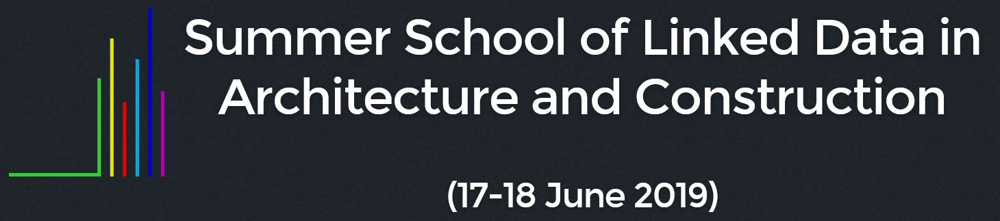

# Summer School Of LDAC
   
This repository contains the documentation and source of the coding challenge of the [Summer School of Linked Data in Architecture and Construction](http://linkedbuildingdata.net/ldac2019/summerschool/) held 17 - 18 June in Lisbon, Portugal. The summer school precedes the [7th Workshop on Linked Data in Architecture and Construction (LDAC)](http://linkedbuildingdata.net/ldac2019/).

## Getting Started

Please move to [Index](Notebooks/Index.ipynb) to start working with the material of the 2019 edition of the Summer School of LDAC.

## Usage and Tools

The content of this summer school are distributed using [Jupyter](https://jupyter.org/) notebooks. The notebooks can be statically examined in Github by simply clicking on it. To execute the scripts they can be either locally executed or the project can be opened using [Binder](https://mybinder.org). For the local usage a [iPyhton](https://ipython.org/) installation is required. We suggest using a python distribution such as [Anaconda](https://www.anaconda.com/distribution/) to work locally.

If you are not familiar to iPython/ Jupyter etc. please refer to the [introductory content](https://jakevdp.github.io/PythonDataScienceHandbook/01.00-ipython-beyond-normal-python.html) by Jake VanderPlas

## Authors

A couple of persons contributed to the content of this repository (Sorted alphabetically):

* **Matthias Bonduel**, [RG](https://www.researchgate.net/profile/Mathias_Bonduel)  
* **Rui de Klerk**, [RG](https://www.researchgate.net/profile/Rui_De_Klerk)  
* **Kris McGlinn**, [RG](https://www.researchgate.net/profile/Dr_Kris_Mcglinn)  
* **Georg Ferdinand Schneider**, [RG](https://www.researchgate.net/profile/Georg_Schneider3)  
**Walter Terkaj**, [RG](https://www.researchgate.net/profile/Walter_Terkaj)  
* **Anna Wagner**, [RG](https://www.researchgate.net/profile/Anna_Wagner13)  

## Acknowledgements

The authors would like to thank Jake VanderPlas [@jakvdp](https://github.com/jakevdp) for providing his [Python Data Science Handbook](https://github.com/jakevdp/PythonDataScienceHandbook/) [(Oreilly)](http://shop.oreilly.com/product/0636920034919.do) open source as the structure of the content provided in this repository follows the approach chosen by him for his book.

## Data

We store some open data obtained from other sources in the [data](data) folder of this repository:

* 2012-03-23-Duplex-Handover.xlsx from *Common Building Information Model Files and Tools* by E. William East, PhD, PE - Engineer Research and Development Center, U.S Army, Corps of Engineers, [https://www.nibs.org/page/bsa_commonbimfiles#project1](https://www.nibs.org/page/bsa_commonbimfiles#project1), Last accessed 12 May 2019.

## License

### Code
All source code provided in this repository is licensed under the [MIT license](LICENSE-CODE).

### Text
The textual description in the notebooks and all other content which is not source code is licensed under the [CC-BY-SA-4.0](LICENSE-TEXT) license.
